# TRABALHO DE PROGRAMAÇÃO EM MICROINFORMÁTICA | 2º BIMESTRE

A proposta deste trabalho era desenvolver uma página web com funcionalidades
simples, utilizando as tecnologias HTML, CSS e JavaScript.

## Sobre o Trabalho

### Funcionalidades Propostas

- [x] Formulário de cadastro: não foi especificado o que deveria ser cadastrado,
  mas foi implementado um formuláriode usuário com os campos nome, email, data
  de nascimento e estado (ativo ou inativo).
- [x] Gráficos: foram solicitados 3 gráficos diferentes, que foram implementados
  utilizando a biblioteca Chart.js.

### Funcionalidades Extras

- [x] Utilitário de validação: foi implementada uma classe utilitária para
  validação dos modelos de dados, que pode ser utilizada para validar os dados
  do formulário de cadastro.
- [x] Utilitário de mensageria por eventos: foi implementada uma classe
  utilitária para enviar mensagens entre os componentes da aplicação, utilizando
  o padrão de eventos. Essa classe pode ser utilizada para enviar mensagens
  entre os componentes da aplicação, como por exemplo, para notificar a criação
  de um novo usuário no formulário de cadastro.
- [x] Classe de modelo e DTOs para operações: foi implementada uma classe de
  modelo para o usuário, que pode ser utilizada para representar os dados do
  usuário completo. Além disso, foram implementados DTOs (Data Transfer Objects)
  para as operações de criação e atualização do usuário, que podem ser
  utilizados para transferir os dados do usuário entre os componentes da
  aplicação.
- [x] Tabela de usuários: foi implementada uma tabela para exibir os usuários
  cadastrados, com a possibilidade de editar e excluir os usuários.
- [x] Modal de atualização: foi implementado um modal para atualizar os dados do
  usuário, que pode ser utilizado para editar os dados do usuário na tabela de
  usuários.

### Melhorias Propostas

- [ ] Implementar um utilitário de persistência de dados usando o IndexDB, para
  armazenar os dados do usuário de forma persistente no navegador.
- [ ] Implementar um sistema de importação e exportação de dados, para permitir
  que os usuários possam importar e exportar os dados do usuário em formato
  JSON, CSV, XML e talvez até Excel.
- [ ] Implementar um modal de confirmação para exclusão de usuários, para evitar
  que os usuários sejam excluídos acidentalmente.
- [ ] Implementar mais algumas funcionalidades úteis, como exclusão em massa de
  usuários, ordenação e filtragem da tabela de usuários.

## Tecnologias Utilizadas

- 
- 
- 
- 
- 

## Como Executar o Projeto

Para executar o projeto, basta abrir o arquivo `index.html` localizado no
diretório `src` em um navegador web moderno. O projeto não requer nenhuma
configuração adicional e pode ser executado diretamente do navegador.

## Sobre a Organização do Projeto

O código-fonte do projeto está localizado no diretório `src`, que contém os
arquivos HTML, CSS e JavaScript necessários para a execução do projeto. Os três
arquivos principais são:
- `index.html`: o arquivo HTML principal que contém a estrutura da página.
- `style.css`: o arquivo CSS que contém os estilos da página.
- `script.js`: o arquivo JavaScript que instancia os componentes e implementa o
  fluxo de dados da aplicação.

Além disso, o projeto contém os seguintes diretórios e arquivos:

- `components/`: contém os componentes reutilizáveis da aplicação, como o
  formulário de cadastro, a tabela de usuários e o modal de atualização.
- `data/`: contém as classes de modelo e DTOs para as operações de criação e
  atualização do usuário.
- `types/`: contém algumas definições de tipos TypeScript usados para melhorar o
  IntelliSense e a legibilidade do código. Esse código não é compilado e não
  afeta a execução do projeto.
- `utils/`: contém as classes utilitárias para validação e mensageria por
  eventos.

### Módulo `utils`

Apesar dele ser o último listado, vou explicá-lo primeiro pois ele é consumido
pelos outros módulos. Os três arquivos principais deste módulo são:

- `Event.js`: contém a classe `Event`, que implementa o padrão de eventos para
  enviar mensagens entre os componentes da aplicação.
- `Parser.js`: contém a classe `Parser`, que permite validar os dados do usuário
  de forma genérica através da definição de regras de validação.
- `Throw.js`: contém a classe "estática" `Throw`, que implementa métodos para
  lançar erros de acordo com uma condição, e um método que permite lançar
  exceções em expressões (útil para lançar excessões usando operadores como
  `?:`, `??`, `&&` e `||`).

#### A classe `Throw`

A classe `Throw` é amplamente utilizada no projeto para lançar erros de
validação de forma mais prática e legível. Por exemplo, ao validar o email do
usuário, é possível utilizar o seguinte código:

```javascript
Throw.if(typeof email !== 'string' || email.trim() === '' || !email.includes('@'),
  'Email inválido');
```

Apesar de ser possível utilizar o `if` tradicional, usar a classe `Throw`
permite escrever menos código *boilerplate* e focar na lógica de validação sem
se preocupar com a estrutura do código. Além disso, a classe `Throw` permite
encadear validações de forma prática, como no exemplo abaixo:

```javascript
Throw.if(
  typeof email !== 'string' || email.trim() === '' || !email.includes('@'),
  'Email inválido'
).if(
  typeof name !== 'string' || name.trim() === '',
  'Nome inválido'
).if(
  !isActive && !isInactive,
  'Estado inválido'
);
```

#### A classe `Event`

Essa classe é uma implementação simples do padrão de eventos, um dos padrões
mais utilizados na programação. Ela permite que os componentes da aplicação se
comuniquem de forma desacoplada, enviando e recebendo mensagens através de
eventos. A classe `Event` permite registrar ouvintes (subscriber) para eventos
específicos e disparar esses eventos com dados associados. Por exemplo, para
notificar a criação de um novo usuário, é possível utilizar o seguinte código:

```javascript
// definindo o evento
const onUserCreated = new Event();

// registrando o ouvinte
onUserCreated.subscribe((user) => {
  console.log('Usuário criado:', user);
});

// disparando o evento
onUserCreated.notify({ name: 'João', email: 'joao@example.com' });
```

Para evitar que outros objetos possam disparar um evento, as instâncias da
classe `Event` expõem um *getter* chamado `subscribers`, que retorna um objeto
que representa uma coleção de ouvintes e que possui métodos para adicionar e
excluir ouvintes. Para expor o evento, a classe que o utiliza deve definir um
`getter` que retorna essa propriedade.

Por exemplo, no componente de cadastro de usuário, o evento de criação de
usuário é exposto através do `getter` `onSubmit`:

```javascript
#onSubmit = new Event();

/**
 * @returns {Subscribers<[UserInsertDTO]>}
 */
get onSubmit() {
  return this.#onSubmit.subscribers;
}
```

Agora, para outros componentes se inscreverem nesse evento, eles podem fazer o
seguinte:

```javascript
userInsertForm.onSubmit.subscribe((user) => {
  console.log('Usuário criado:', user);
});
```

E como a instância de `Event` é privada, outros componentes não podem disparar o
evento diretamente, garantindo que apenas o componente de cadastro de usuário
possa disparar o evento de criação de usuário:

```javascript
userInsertForm.onSubmit.notify({ name: 'João', email: 'joao@example.com' }); // Erro: notify não é uma função
```

O fluxo de dados da aplicação é implementado através do uso de eventos, onde no
script `script.js` são instanciados os componentes e registrados os ouvintes
para os eventos. Esse fluxo está organizado da seguinte forma:

```mermaid
flowchart TD
  subgraph "Delete Flow"
    UTR2[UsersTableRow]
    UTB4[UsersTableBody]
    CH3[Charts]
    UTR2 -->|onDelete| UTB4
    UTB4 -->|onDelete| CH3
  end

  subgraph "Edit Flow"
    UTR[UsersTableRow]
    UTB2[UsersTableBody]
    UEF[UserEditForm]
    UTB3[UsersTableBody]
    CH2[Charts]
    UTR -->|onEdit| UTB2
    UTB2 -->|onEdit| UEF
    UEF -->|onSave| UTB3
    UTB3 -->|onUpdate| CH2
  end

  subgraph "Insert Flow"
    URF[UserRegistrationForm]
    UTB1[UsersTableBody]
    CH[Charts]
    URF -->|onSubmit| UTB1
    UTB1 -->|onInsert| CH
  end
```



#### A classe `Parser`

Essa classe é utilizada para validar os dados passados como parâmetros para as
estruturas de dados do projeto, como a classe `User` e os DTOs (`UserInsertDTO`
e `UserUpdateDTO`). Ela permite definir regras de validação para os dados com
uma sintaxe fluente e validar e lidar com os erros de validação de forma
prática. Por exemplo, para validar o DTO de inserção de usuário, é possível
utilizar o seguinte código:

```javascript
const parser = Parser.for('UserInsertDTO')
  .defineRule({
    field: 'name',
    validator(value) {
      if (typeof value !== 'string' || value.trim() === '')
        return 'Nome inválido. Deve ser uma string não vazia';
    },
    required: true,
  })
  .defineRule({
    field: 'email',
    validator(value) {
      if (typeof value !== 'string' || value.trim() === '' || !value.includes('@'))
        return 'Email inválido. Deve ser uma string não vazia e conter "@"';
    },
    required: true,
  })
  .defineRule({
    field: 'birthDate',
    validator(value) {
      if (!(value instanceof Date) || isNaN(value.getTime()))
        return 'Data de nascimento inválida. Deve ser uma data válida';
    },
    required: true,
  })
  .defineRule({
    field: 'isActive',
    validator(value) {
      if (typeof value !== 'boolean')
        return 'Estado inválido. Deve ser um booleano';
    },
    required: true,
  });

const validDTO = {
  name: 'João',
  email: 'joao@example.com',
  birthDate: new Date('2000-01-01'),
  isActive: true,
};

const invalidDTO = {
  name: '',
  email: 'joaoexample.com',
  birthDate: '2000-01-01',
  isActive: 'ativo',
};

parser.parse(validDTO)
  .on({
    success(user) {
      console.log('DTO válido:', JSON.stringify(user));
    },
    failure(errors) {
      console.error('Erros de validação:', errors.join(', '));
    },
  }); // Saída: DTO válido: { "name": "João", "email": "joao@example.com", "birthDate": "2000-01-01T00:00:00.000Z", "isActive": true }

parser.parse(invalidDTO)
  .on({
    success(user) {
      console.log('DTO válido:', JSON.stringify(user));
    },
    failure(errors) {
      console.error('Erros de validação:', errors.join('; '));
    },
  }); // Saída: Erros de validação: Nome inválido. Deve ser uma string não vazia; Email inválido. Deve ser uma string não vazia e conter "@"; Data de nascimento inválida. Deve ser uma data válida; Estado inválido. Deve ser um booleano
```

### Módulo `data`

Esse módulo contém as classes de modelo e DTOs para as operações de criação e
atualização do usuário. As classes principais desse módulo são:

- `User.js`: contém a classe `User`, que representa o modelo de usuário
  completo, com os campos listados abaixo:

```typescript
type User = {
  id: number;
  name: string;
  email: string;
  birthDate: Date;
  isActive: boolean;
  createdAt: Date;
  updatedAt: Date;
}
```

- `UserInsertDTO.js`: contém a classe `UserInsertDTO`, que representa os dados
  necessários para criar um novo usuário, com os campos listados abaixo:

```typescript
type UserInsertDTO = Pick<User, 'name' | 'email' | 'birthDate' | 'isActive'>;

// equivalente a:

type UserInsertDTO = {
  name: string;
  email: string;
  birthDate: Date;
  isActive: boolean;
}
```

Possui um método `toUser` que converte o DTO em uma instância da classe `User`,
atribuindo `id`, `createdAt` e `updatedAt` com valores passados como argumentos.

```javascript
const userInsertDTO = UserInsertDTO.fromObject({
  name: 'João',
  email: 'joao@example.com',
  birthDate: new Date('2000-01-01'),
  isActive: true,
});

const user = userInsertDTO.toUser({
  id: 1,
  createdAt: new Date(),
  updatedAt: new Date(),
});

console.log(user); // Saída: User { id: 1, name: 'João', email: 'joao@example.com', birthDate: 2000-01-01T00:00:00.000Z, isActive: true, createdAt: 2023-10-01T00:00:00.000Z, updatedAt: 2023-10-01T00:00:00.000Z }
```

- `UserUpdateDTO.js`: contém a classe `UserUpdateDTO`, que representa os dados
  necessários para atualizar um usuário existente, com os campos listados
  abaixo:

```typescript
type UserUpdateDTO = Partial<Pick<User, 'name' | 'email' | 'birthDate' | 'isActive'>>;

// equivalente a:

type UserUpdateDTO = {
  name?: string;
  email?: string;
  birthDate?: Date;
  isActive?: boolean;
}
```

Essa classe, de forma semelhante ao `UserInsertDTO`, possui um método auxiliar
`applyTo` que cria uma nova instância da classe `User` a partir das informações
do DTO, mesclando os dados existentes com os novos dados passados como
argumento. Isso permite atualizar apenas os campos que foram modificados,
mantendo os outros campos inalterados. Por exemplo:

```javascript
const userUpdateDTO = UserUpdateDTO.fromObject({
  name: 'João Silva',
  email: 'joao@example.com',
  isActive: false,
});

const existingUser = new User({
  id: 1,
  name: 'João',
  email: 'joao@example.com',
  birthDate: new Date('2000-01-01'),
  isActive: true,
  createdAt: new Date('2023-10-01'),
  updatedAt: new Date('2023-10-01'),
});

const updatedUser = userUpdateDTO.applyTo(existingUser);
console.log(updatedUser); // Saída: User { id: 1, name: 'João Silva', email: 'joao@example.com', birthDate: 2000-01-01T00:00:00.000Z, isActive: false, createdAt: 2023-10-01T00:00:00.000Z, updatedAt: 2023-10-01T00:00:00.000Z }
```

---

As últimas duas classes são DTOs (Data Transfer Objects) que são utilizadas para
transferir os dados do usuário entre os componentes da aplicação. Elas são
utilizadas para validar os dados do usuário antes de serem enviados para o
componente de tabela de usuários, onde os dados são exibidos e podem ser
atualizados ou excluídos.

### Módulo `components`

Esse módulo contém os componentes reutilizáveis da aplicação, como o formulário
de cadastro, a tabela de usuários e o modal de atualização. Os componentes são
os seguintes:

- `UserRegistrationForm.js`: contém a classe `UserRegistrationForm`, que
  implementa o formulário de cadastro de usuário. Ele possui um evento
  `onSubmit` que é disparado quando o formulário é enviado, passando os dados do
  usuário como parâmetro.
- `UsersTableBody.js`: contém a classe `UsersTableBody`, que implementa a tabela
  de usuários. Ela possui os eventos `onInsert`, `onEdit`, `onUpdate` e
  `onDelete`, que são disparados, respectivamente, quando um novo usuário é
  inserido, quando ocorre uma solicitação de edição de um usuário, quando um
  usuário é atualizado e quando um usuário é excluído. Esses eventos são
  utilizados para atualizar os gráficos.
- `UsersTableRow.js`: contém a classe `UsersTableRow`, que implementa uma linha
  da tabela de usuários. Ela possui os eventos `onEdit` e `onDelete`, que são
  disparados quando ocorre uma solicitação de edição ou exclusão de um usuário,
  respectivamente. Esses eventos são mediados pelo componente `UsersTableBody`.
- `UserEditForm.js`: contém a classe `UserEditForm`, que implementa o formulário
  de edição de usuário. Ele possui o evento `onSave`, que é disparado quando o
  formulário é salvo, passando os dados do usuário atualizado como parâmetro.
- `Charts.js`: contém a classe `Charts`, que implementa funcionalidades
  genéricas para renderizar gráficos utilizando a biblioteca Chart.js, e
  atualiza os gráficos quando os eventos `onInsert`, `onUpdate` e `onDelete` são
  disparados pelos componentes de tabela de usuários.

### Módulo `types`

Esse módulo apenas contém algumas definições de tipos TypeScript usados para
melhorar o IntelliSense e a legibilidade do código. Esse código não é compilado
e não afeta a execução do projeto.

## Contribuindo

Críticas? Sugestões? Correções? Sinta-se à vontade para abrir uma issue ou pull
request no repositório do projeto.

## Licença

Esse projeto é licenciado sob a licença MIT. Veja o arquivo [LICENSE](LICENSE)
para mais detalhes.

## Contato

Você pode entrar em contato comigo através do meu
[LinkedIn](https://www.linkedin.com/in/luigi-campregher-fran%C3%A7a-866a142a9/),
ou pelo meu Discord: `Lubrisa`;